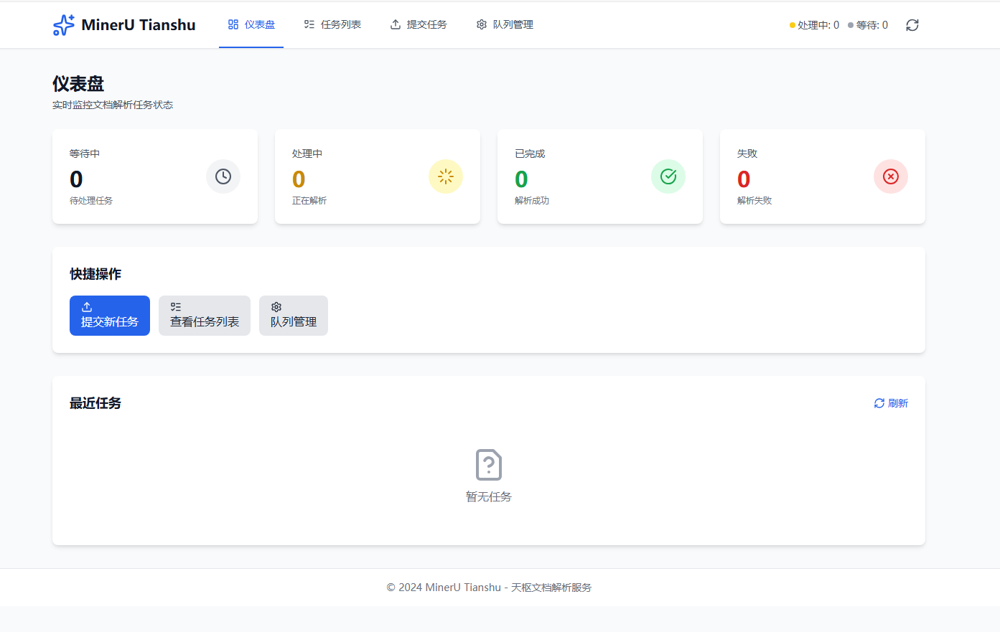
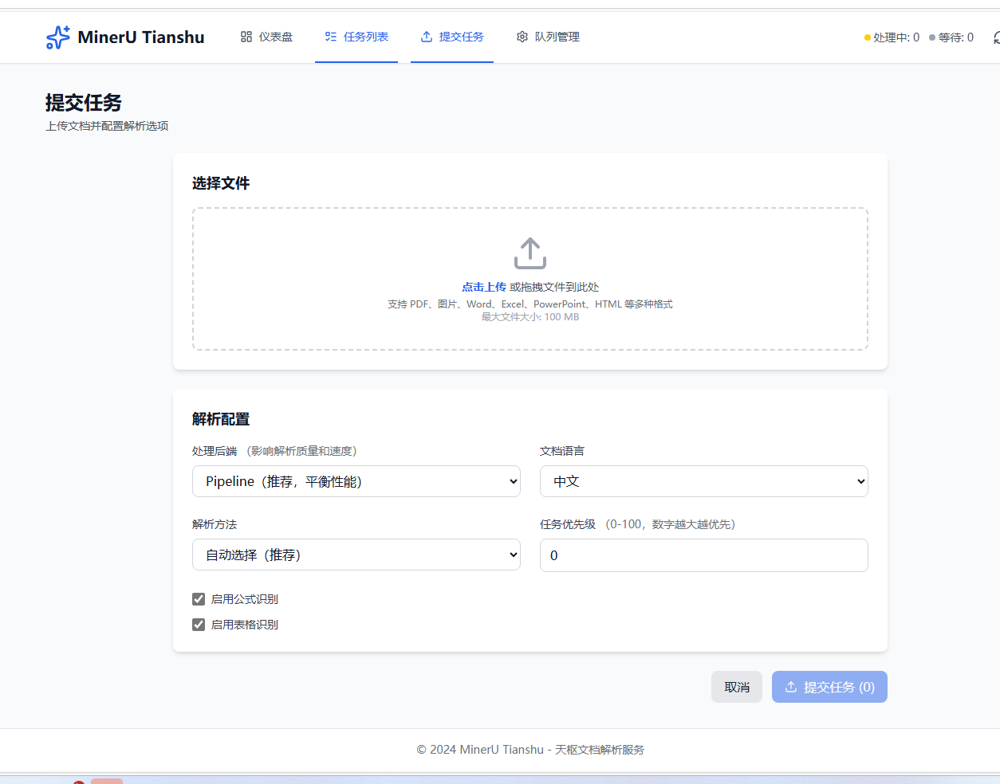

<div align="center">

# Tianshu 天枢

**Enterprise-grade AI Data Preprocessing Platform**

Multi-modal Data Processing (Documents, Images, Audio) | GPU Acceleration | MCP Protocol

Vue 3 Frontend + FastAPI Backend + LitServe GPU Load Balancing

<p>
  <a href="https://github.com/magicyuan876/mineru-tianshu/stargazers">
    
  </a>
  <a href="https://github.com/magicyuan876/mineru-tianshu/network/members">
    
  </a>
  <a href="https://github.com/magicyuan876/mineru-tianshu/blob/main/LICENSE">
    
  </a>
</p>

<p>
  
  
  
  
  
</p>

English | [简体中文](./README.md)

<p>
  <a href="https://github.com/magicyuan876/mineru-tianshu">
    
  </a>
</p>

**If you find this project helpful, please ⭐ Star it! Your support means a lot!**

</div>

---

## 📝 Latest Updates

### 2025-12-05 🗄️ RustFS Object Storage Integration

- ✅ **RustFS Object Storage**: All parsed images automatically uploaded to object storage
  - S3-compatible API based on minio-py
  - Batch image upload with auto-generated public URLs
  - Short and unique filename generation (timestamp Base62 + NanoID)
  - Auto-grouped by date (YYYYMMDD/filename.ext)
  - Image paths in Markdown/JSON automatically replaced with object storage URLs
  - One-click RustFS deployment with Docker Compose
  - Requires `RUSTFS_PUBLIC_URL` environment variable (externally accessible address)
- ✅ **Output Standardization Enhancement**: Improved image path handling, unified object storage URLs
- ✅ **Configuration Simplification**: Streamlined `.env.example`, removed redundant options

### 2025-11-12 📦 Code Optimization & Documentation Cleanup

- ✅ **Output Standardization**: Unified Markdown/JSON output format, optimized image path handling
- ✅ **Documentation Cleanup**: Streamlined README, removed redundant documentation files, kept project clean
- ✅ **Code Quality**: Improved error handling, enhanced logging, increased system stability

### 2025-10-30 🐳 Docker Deployment + Enterprise Authentication

- ✅ **Docker Containerization Support**
  - **One-Click Deployment**: Complete full-stack deployment with `make setup` or deployment scripts
  - **Multi-Stage Build**: Optimized image size, separated dependency and application layers
  - **GPU Support**: NVIDIA CUDA 12.6 + Container Toolkit integration
  - **Service Orchestration**: Complete orchestration of frontend, backend, Worker, MCP (docker-compose)
  - **Developer Friendly**: Hot reload, remote debugging (debugpy), real-time logs
  - **Production Ready**: Health checks, data persistence, zero-downtime deployment, resource limits
  - **Cross-Platform Scripts**:
    - Linux/Mac: `scripts/docker-setup.sh` or `Makefile`
    - Windows: `scripts/docker-setup.bat`
  - **Complete Documentation**: `scripts/DOCKER_QUICK_START.txt`, `scripts/docker-commands.sh`
  - See: Docker configuration files (`docker-compose.yml`, `backend/Dockerfile`, `frontend/Dockerfile`)

- ✅ **Enterprise-Grade User Authentication & Authorization**
  - **JWT Authentication**: Secure token-based authentication with Access Token and Refresh Token
  - **User Data Isolation**: Each user can only access and manage their own task data
  - **Role-Based Access**: Administrator (admin) and regular user (user) roles
  - **API Key Management**: Users can self-generate and manage API keys for third-party integration
  - **User Management**: Admins can manage all users, reset passwords, enable/disable accounts
  - **SSO Ready**: Support for OIDC and SAML 2.0 single sign-on (optional configuration)
  - **Frontend Integration**: Login/registration pages, user profile, permission route guards
  - **Database Migration**: Automatic default user creation for existing data
  - See: `backend/auth/` directory

### 2025-10-29 🧬 Bioinformatics Format Support

- ✅ **New Plugin-Based Format Engine System**
  - Support for parsing and structuring professional domain document formats
  - Unified engine interface, easy to extend new formats
  - Provide both Markdown and JSON format output for RAG applications

- ✅ **Bioinformatics Format Engines**
  - **FASTA Format**: DNA/RNA/Protein sequence parsing
    - Sequence statistics (count, length, average)
    - Base composition analysis (A/T/G/C ratios)
    - Automatic sequence type detection (DNA/RNA/Protein)
  - **GenBank Format**: NCBI gene sequence annotation format
    - Complete annotation information extraction
    - Feature type statistics (gene/CDS/mRNA, etc.)
    - GC content calculation and organism information
  - Support BioPython or built-in parser (optional dependency)
  - See: `backend/format_engines/README.md`

### 2025-10-27 🎨 Watermark Removal Support (🧪 Experimental)

- ✅ **Intelligent Watermark Detection and Removal**
  - YOLO11x specialized detection model + LaMa high-quality inpainting
  - Support for images (PNG/JPG/JPEG etc.) and PDFs (editable/scanned)
  - Frontend adjustable parameters: detection confidence, removal range
  - Auto-save debug files (detection visualization, masks, etc.)
  - Lightweight models, fast processing, low VRAM usage

> **⚠️ Experimental Feature**: May not work well for certain special watermarks. Test on small scale first.  
> 📖 **Detailed Guide**: [Watermark Removal Optimization Guide](backend/remove_watermark/README_EN.md)

### 2025-10-24 🎬 Video Processing Support

- ✅ **New Video Processing Engine**
  - Support for mainstream video formats: MP4, AVI, MKV, MOV, WebM, etc.
  - **Audio Transcription**: Extract audio from videos and transcribe to text (FFmpeg + SenseVoice)
  - **Keyframe OCR (🧪 Experimental)**: Automatic keyframe extraction and OCR recognition
    - Scene detection: Adaptive scene change detection based on frame difference
    - Quality filtering: Laplacian variance + brightness assessment
    - Image deduplication: Perceptual hashing (pHash) + Hamming distance
    - Text deduplication: Edit distance algorithm to avoid redundant content
    - Support for PaddleOCR-VL engine
  - Multi-language recognition, speaker diarization, emotion recognition
  - Output timestamped transcripts in JSON and Markdown formats
  - Details: `backend/video_engines/README.md`

### 2025-10-23 🎙️ Audio Processing Engine

- ✅ **New SenseVoice Audio Recognition Engine**
  - Multi-language recognition (Chinese/English/Japanese/Korean/Cantonese)
  - Built-in speaker diarization
  - Emotion recognition (Neutral/Happy/Angry/Sad)
  - Event detection (Speech/Applause/BGM/Laugh)
  - Output in JSON and Markdown formats with emoji visualization
  - Details: `backend/audio_engines/README.md`

### 2025-10-23 ✨

**🎯 Structured JSON Format Output Support**

- MinerU (pipeline) and PaddleOCR-VL engines now support structured JSON format output
- JSON output contains complete document structure information (pages, paragraphs, tables, etc.)
- Users can switch between Markdown and JSON formats in the task detail page
- Frontend provides an interactive JSON viewer with expand/collapse, copy, and download features

**🎉 New PaddleOCR-VL Multi-Language OCR Engine**

- Support for 109+ language automatic recognition without manual specification
- Enhanced features: document orientation, text unwarping, layout detection
- Native PDF multi-page support with automatic model download
- Documentation: [backend/paddleocr_vl/README.md](backend/paddleocr_vl/README.md)

---

## 🌟 Introduction

MinerU Tianshu is an **Enterprise-grade AI Data Preprocessing Platform** that converts unstructured data into AI-ready structured formats:

- **📄 Documents**: PDF, Word, Excel, PPT → Markdown/JSON (MinerU, PaddleOCR-VL 109+ languages, Watermark Removal🧪)
- **🎬 Videos**: MP4, AVI, MKV → Speech Transcription + Keyframe OCR🧪 (FFmpeg + SenseVoice)
- **🎙️ Audio**: MP3, WAV, M4A → Transcription + Speaker Diarization (SenseVoice Multi-language)
- **🖼️ Images**: JPG, PNG → Text Extraction + Structuring (Multiple OCR Engines + Watermark Removal🧪)
- **🧬 Bio Formats**: FASTA, GenBank → Markdown/JSON (Plugin-based Engines, Extensible)
- **🏗️ Enterprise**: GPU Load Balancing, Task Queue, JWT Auth, MCP Protocol, Modern Web UI

## 📸 Screenshots

<div align="center">

### 📊 Dashboard - Real-time Monitoring



*Real-time queue statistics and recent tasks monitoring*

---

### 📤 Task Submission - Drag & Drop Upload



*Supports batch processing and advanced configuration*

---

### ⚙️ Queue Management - System Monitoring


*Reset timeout tasks and clean up old files*

</div>

### Main Features

- ✅ **User Auth**: JWT authentication, role-based access, API key management
- ✅ **Task Management**: Drag-drop upload, batch processing, real-time tracking, Markdown/JSON preview
- ✅ **Queue Management**: System monitoring, timeout reset, file cleanup
- ✅ **MCP Protocol**: Seamless AI assistant (Claude Desktop) integration
- ✅ **Docker Deployment**: One-click deployment, GPU support, full containerization

### Supported File Formats

- 📄 **Documents**: PDF, Word, Excel, PPT (MinerU, PaddleOCR-VL, MarkItDown)
- 🖼️ **Images**: JPG, PNG, BMP, TIFF (MinerU, PaddleOCR-VL)
- 🎙️ **Audio**: MP3, WAV, M4A, FLAC (SenseVoice multi-language, speaker diarization, emotion recognition)
- 🎬 **Video**: MP4, AVI, MKV, MOV, WebM (audio transcription + keyframe OCR🧪)
- 🧬 **Bio Formats**: FASTA, GenBank (sequence statistics, base analysis, GC content)
- 🌐 **Others**: HTML, Markdown, TXT, CSV

## 🏗️ Project Structure

```
mineru-server/
├── frontend/              # Vue 3 Frontend (TypeScript + TailwindCSS)
│   ├── src/               # Source (api, components, views, stores, router)
│   └── vite.config.ts
│
├── backend/               # Python Backend (FastAPI + LitServe)
│   ├── api_server.py      # API Server
│   ├── litserve_worker.py # GPU Worker Pool
│   ├── mcp_server.py      # MCP Protocol Server
│   ├── auth/              # Authentication (JWT, SSO)
│   ├── audio_engines/     # Audio Engine (SenseVoice)
│   ├── video_engines/     # Video Engine (FFmpeg + OCR)
│   ├── format_engines/    # Format Engines (FASTA, GenBank)
│   ├── remove_watermark/  # Watermark Removal (YOLO11x + LaMa)
│   └── requirements.txt
│
├── scripts/               # Deployment Scripts
│   ├── docker-setup.sh    # Linux/Mac Deployment
│   └── docker-setup.bat   # Windows Deployment
│
├── docker-compose.yml     # Docker Orchestration
└── Makefile               # Shortcuts
```

## 🚀 Quick Start

### Option 1: Docker Deployment (⭐ Recommended)

**Prerequisites**: Docker 20.10+, Docker Compose 2.0+, NVIDIA Container Toolkit (GPU optional)

```bash
# One-click deployment
make setup

# Or use scripts
./scripts/docker-setup.sh    # Linux/Mac
scripts\docker-setup.bat     # Windows

# Common commands
make start    # Start services
make stop     # Stop services
make logs     # View logs
```

**Service Access**:
- Frontend: http://localhost:80
- API Docs: http://localhost:8000/docs
- Worker: http://localhost:8001
- MCP: http://localhost:8002

---

### Option 2: Local Development

**Prerequisites**: Node.js 18+, Python 3.8+, CUDA (optional)

**1. Install Dependencies**

```bash
cd backend
bash install.sh              # Linux/macOS auto-install
# or pip install -r requirements.txt
```

**2. Start Backend**

```bash
cd backend
python start_all.py          # Start all services
python start_all.py --enable-mcp  # Enable MCP protocol
```

**3. Start Frontend**

```bash
cd frontend
npm install
npm run dev                  # http://localhost:3000
```

## 📖 Usage Guide

### Submit a Task

1. Click "Submit Task" in the top navigation bar
2. Drag and drop or click to upload files (supports batch upload)
3. Configure parsing options:
   - Select processing backend (pipeline/vlm-transformers/vlm-vllm-engine)
     - **pipeline**: MinerU standard pipeline, suitable for general document parsing
     - **vlm-transformers**: MinerU VLM mode (Transformers)
     - **vlm-vllm-engine**: MinerU VLM mode (vLLM engine)
     <!-- - **deepseek-ocr**: DeepSeek OCR engine, suitable for high-precision OCR needs -->
   - Set document language
   - Enable formula/table recognition
   - Set task priority
4. Click "Submit Task"

### View Task Status

1. Find your task in the dashboard or task list
2. Click "View" to enter the task details page
3. Page automatically polls for status updates
4. When task is completed, you can:
   - Preview Markdown results
   - Download Markdown file
   - View processing time and error messages (if failed)

### Manage Queue

1. Click "Queue Management" in the top navigation bar
2. View real-time queue statistics
3. Perform management operations:
   - Reset timeout tasks
   - Clean up old task files
   - System health check

## 🎯 Core Features

### Frontend Features

- **Modern UI**: Beautiful interface based on TailwindCSS
- **Responsive Design**: Perfect adaptation for desktop and mobile
- **Real-time Updates**: Automatic refresh of queue statistics and task status
- **Batch Operations**: Support for batch file upload and task management
- **Markdown Preview**: Real-time rendering of parsing results with code highlighting

### Backend Features

- **Worker Active Pull**: 0.5s response time, no scheduler trigger needed
- **Concurrency Safe**: Atomic operations prevent task duplication, supports multi-worker concurrency
- **GPU Load Balancing**: LitServe automatic scheduling, avoiding VRAM conflicts
- **Multi-GPU Isolation**: Each process only uses allocated GPUs
- **Automatic Cleanup**: Periodically clean old result files, retain database records
- **Multiple Parsing Engines**:
  - **MinerU**: Complete document parsing with table and formula recognition
  - **PaddleOCR-VL**: Multi-language OCR (109+ languages), document enhancement processing
  - **MarkItDown**: Office document and web page parsing
- **MCP Protocol**: AI assistants can call document parsing service via standard protocol

## ⚙️ Configuration

### Backend Configuration

```bash
# Custom startup configuration
python backend/start_all.py \
  --output-dir /data/output \
  --api-port 8000 \
  --worker-port 9000 \
  --accelerator cuda \
  --devices 0,1 \
  --workers-per-device 2

# Enable MCP protocol support
python backend/start_all.py --enable-mcp --mcp-port 8001
```

See [backend/README.md](backend/README.md) for details.

### MCP Protocol Integration

MinerU Tianshu supports **Model Context Protocol (MCP)**, allowing AI assistants (like Claude Desktop) to directly call the document parsing service.

#### What is MCP?

MCP is an open protocol introduced by Anthropic that allows AI assistants to directly call external tools and services without manual API integration.

#### Quick Configuration

**1. Start service with MCP enabled**

```bash
cd backend
python start_all.py --enable-mcp
```

After startup, MCP Server will run at `http://localhost:8002/mcp`.

**2. Configure Claude Desktop**

Edit the configuration file (based on your OS):

- **Windows**: `%APPDATA%\Claude\claude_desktop_config.json`
- **macOS**: `~/Library/Application Support/Claude/claude_desktop_config.json`
- **Linux**: `~/.config/Claude/claude_desktop_config.json`

Add the following content:

```json
{
  "mcpServers": {
    "mineru-tianshu": {
      "url": "http://localhost:8002/sse",
      "transport": "sse"
    }
  }
}
```

**Remote server deployment:** Replace `localhost` with your server IP:

```json
{
  "mcpServers": {
    "mineru-tianshu": {
      "url": "http://your-server-ip:8002/sse",
      "transport": "sse"
    }
  }
}
```

**3. Restart Claude Desktop**

After configuration, restart Claude Desktop to apply changes.

**4. Start Using**

In Claude conversation, use natural language directly:

```
Please help me parse this PDF file: C:/Users/user/document.pdf
```

or:

```
Parse this online paper: https://arxiv.org/pdf/2301.12345.pdf
```

Claude will automatically:

1. Read the file or download URL
2. Call MinerU Tianshu parsing service
3. Wait for processing to complete
4. Return results in Markdown format

#### Supported Features

MCP Server provides 4 tools:

1. **parse_document** - Parse documents to Markdown format
   - Input methods: Base64 encoding or URL
   - Supported formats: PDF, images, Office documents, web pages and text
   - File size: Configurable via MAX_FILE_SIZE in .env (default 500MB)

2. **get_task_status** - Query task status and results

3. **list_tasks** - List recent tasks

4. **get_queue_stats** - Get queue statistics

#### Technical Architecture

```
Claude Desktop (Client)
    ↓ MCP Protocol (SSE)
MCP Server (Port 8001)
    ↓ HTTP REST API
API Server (Port 8000)
    ↓ Task Queue
LitServe Worker Pool (Port 9000)
    ↓ GPU Processing
MinerU / MarkItDown
```

#### FAQ

**Q: MCP Server won't start?**

- Check if port 8002 is occupied
- Use `--mcp-port` to specify another port

**Q: Claude Desktop cannot connect?**

1. Confirm MCP Server is running: `curl http://localhost:8002/health`
2. Check if configuration file JSON format is correct
3. Restart Claude Desktop

**Q: File transfer failed?**

- Small files automatically use Base64 encoding
- Files exceeding the limit (default 500MB) will return error, adjustable via MAX_FILE_SIZE in .env
- URL files need to be publicly accessible

**Detailed documentation:** [backend/MCP_GUIDE.md](backend/MCP_GUIDE.md)

### Frontend Configuration

Modify `frontend/.env.development` for development:

```
VITE_API_BASE_URL=http://localhost:8000
```

Modify `frontend/.env.production` for production:

```
VITE_API_BASE_URL=/api
```

See [frontend/README.md](frontend/README.md) for details.

## 🚢 Production Deployment

### Frontend Build

```bash
cd frontend
npm run build
```

Build artifacts will be in the `frontend/dist/` directory.

### Nginx Configuration Example

```nginx
server {
    listen 80;
    server_name your-domain.com;

    # Frontend static files
    root /path/to/frontend/dist;
    index index.html;

    # Frontend routing
    location / {
        try_files $uri $uri/ /index.html;
    }

    # API proxy to backend
    location /api/ {
        proxy_pass http://localhost:8000/api/;
        proxy_set_header Host $host;
        proxy_set_header X-Real-IP $remote_addr;
        proxy_set_header X-Forwarded-For $proxy_add_x_forwarded_for;
    }
}
```

### Backend Deployment

Use systemd or supervisor to manage backend services:

```bash
# Start backend
cd backend
python start_all.py --api-port 8000 --worker-port 9000
```

## 📚 Tech Stack

### Frontend

- Vue 3 (Composition API)
- TypeScript
- Vite
- TailwindCSS
- Vue Router
- Pinia
- Axios
- Marked (Markdown rendering)
- Highlight.js (code highlighting)
- Lucide Vue (icons)

### Backend

- FastAPI
- LitServe
- MinerU
<!-- - DeepSeek OCR -->
- MarkItDown
- SQLite
- Loguru
- MinIO (optional)

## 🔧 Troubleshooting

### Frontend Cannot Connect to Backend

Check if backend is running normally:

```bash
curl http://localhost:8000/api/v1/health
```

Check frontend proxy configuration:

```typescript
// frontend/vite.config.ts
server: {
  proxy: {
    '/api': {
      target: 'http://localhost:8000',
      changeOrigin: true,
    }
  }
}
```

### Worker Cannot Start

Check GPU availability:

```bash
nvidia-smi
```

Check Python dependencies:

```bash
pip list | grep -E "(mineru|litserve|torch)"
```

For more troubleshooting:

- [Frontend Troubleshooting](frontend/README.md)
- [Backend Troubleshooting](backend/README.md)

## 📄 API Documentation

After starting the backend, visit <http://localhost:8000/docs> to view complete API documentation.

Main API endpoints:

- `POST /api/v1/tasks/submit` - Submit task
- `GET /api/v1/tasks/{task_id}` - Query task status
- `DELETE /api/v1/tasks/{task_id}` - Cancel task
- `GET /api/v1/queue/stats` - Get queue statistics
- `GET /api/v1/queue/tasks` - Get task list

## 🤝 Contributing

Issues and Pull Requests are welcome!

## 🙏 Acknowledgments

This project is built upon the following excellent open-source projects:

**Core Engines**

- [MinerU](https://github.com/opendatalab/MinerU) - PDF/Image document parsing
- [PaddleOCR](https://github.com/PaddlePaddle/PaddleOCR) - Multi-language OCR engine
- [SenseVoice](https://github.com/FunAudioLLM/SenseVoice) - Speech recognition & speaker diarization
- [FunASR](https://github.com/modelscope/FunASR) - Speech recognition framework
- [MarkItDown](https://github.com/microsoft/markitdown) - Document conversion tool

**Frameworks & Tools**

- [LitServe](https://github.com/Lightning-AI/LitServe) - GPU load balancing
- [FastAPI](https://fastapi.tiangolo.com/) - Backend web framework
- [Vue.js](https://vuejs.org/) - Frontend framework
- [TailwindCSS](https://tailwindcss.com/) - CSS framework
- [PyTorch](https://pytorch.org/) - Deep learning framework

Thanks to all open-source contributors!

## 📜 License

This project is licensed under the [Apache License 2.0](LICENSE).

```
Copyright 2024 MinerU Tianshu Contributors

Licensed under the Apache License, Version 2.0 (the "License");
you may not use this file except in compliance with the License.
You may obtain a copy of the License at

    http://www.apache.org/licenses/LICENSE-2.0

Unless required by applicable law or agreed to in writing, software
distributed under the License is distributed on an "AS IS" BASIS,
WITHOUT WARRANTIES OR CONDITIONS OF ANY KIND, either express or implied.
See the License for the specific language governing permissions and
limitations under the License.
```

---

<div align="center">

**Tianshu** - Enterprise-grade Multi-GPU Document Parsing Service ⚡️

*Named after the first star of the Big Dipper, symbolizing core scheduling capabilities*

<br/>

### Like this project?

<a href="https://github.com/magicyuan876/mineru-tianshu/stargazers">
  
</a>
<a href="https://github.com/magicyuan876/mineru-tianshu/network/members">
  
</a>

**Click ⭐ Star to support this project. Thank you!**

</div>
